# Marketing Campaign Dashboard

## Project Background
A UK-based clothing retailer ran targeted seasonal marketing campaigns to increase reach, engagement, and online sales across different cities.

The purpose of this project is to consolidate those signals and analyze them in one interactive dashboard to understand what drives results and where the budget can be optimized.

This report provides insight and recommendations concerning key areas as highlighted below.

- Reach & Engagement Performance: Analyze seasonal, city, channel, device, and ad creative-type (discount vs. collection) breakdowns in impressions, CTR, clicks, and social interactions.

- Conversion Funnel Efficiency: Find where users drop off from impressions → clicks → conversions and quantify efficiency by channel and season.

- Cost & Return Effectiveness: Determine how spend, CPC, ROAS, and conversion value are performing to identify which channels and campaigns drive the most efficient return, and which are wasteful.

- Seasonality & City Targeting: Compare Spring / Summer / Fall performance and identify consistently over-performing city–market combinations to assist future targeting and budget allocation.

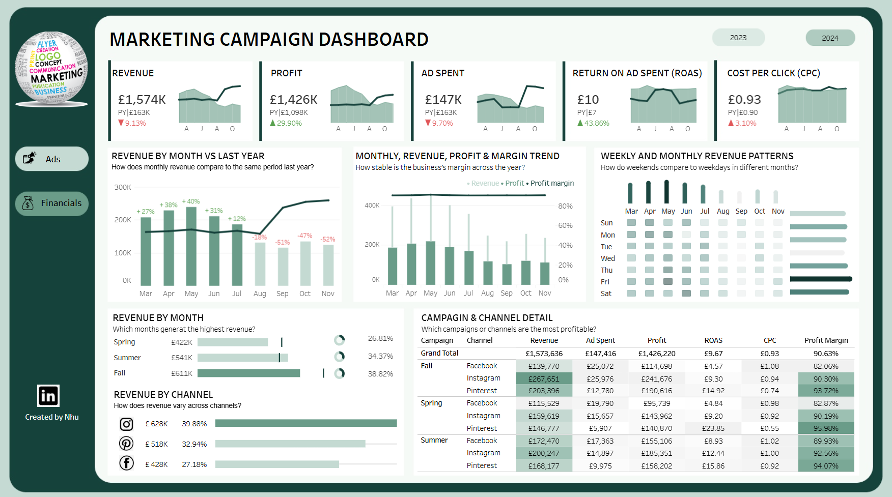

An interactive Tableau dashboard can be downloaded [here](https://public.tableau.com/app/profile/casati.nhu/viz/MarketingCampaignDashboard_17309226405300/AdsMetric).

The SQL queries utilized to clean, organize, and prepare data for the dashboard can be found [here](https://github.com/Nhu93/Marketing-Campaign-Dashboard/blob/main/marketing_campaign_data_prep.sql).

Targeted SQL queries regarding various business questions can be found here.

## Data Pipeline and Reporting Setup

### Step 1. Installing the Database
First, I installed SQL Server Management Studio (SSMS) onto my local machine and ran the database installation scripts locally.

### Step 2. Writing the Scripts
I used the database schema to join the tables together and wrote SQL queries to select and transform the data for three tables:
- `ad_performance_daily`
- `ad_engagement_daily`
- `ad_profit_daily`

SQL logic used for data preparation is available [here](https://github.com/Nhu93/Marketing-Campaign-Dashboard/blob/main/marketing_campaign_data_prep.sql). 

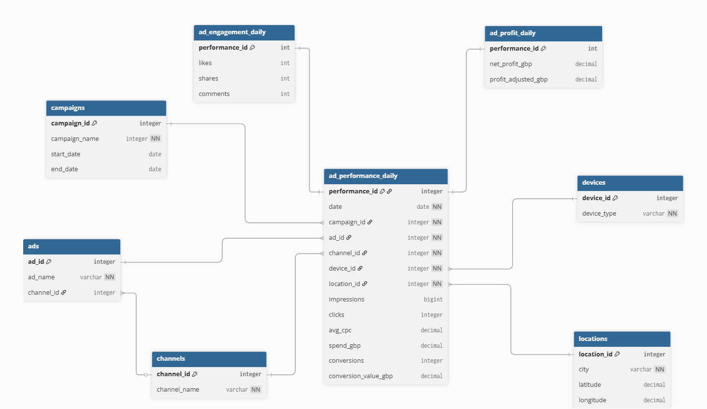

### Step 3. Data Model in Tableau
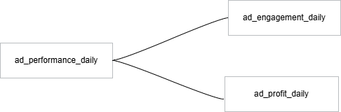

### Step 4. Creating Dashboards
The last step involved creating a Tableau dashboard. Tableau functionality and features used:
- Dynamic Parameters
- Parameter Actions
- Level of Detail Expressions
- Navigation Buttons
- Custom Shapes and Custom Number Formatting

## Executive Summary

### Overview of Findings
Following the increase in reach, the rest of the campaign volume was flat, with **2.95M impressions**, **159K clicks**, and **36K conversions**, alongside a **5.39% CTR**.

While the top funnel was flat, efficiency improved materially, with the conversion rate rising to **22.37%**. Cost levels remained controlled, with a **CPC of 0.93**.

This improved efficiency translated into financial success. The campaigns generated **£1.57M in revenue** and **£1.43M in profit** on **£147K spend**, resulting in a **ROAS of 10**.

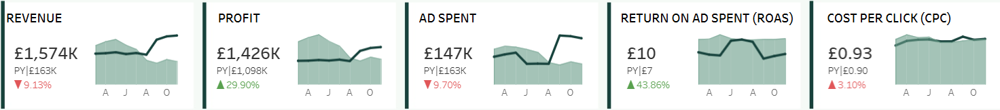
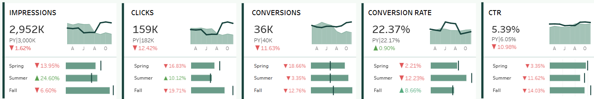

### Financial Performance Deep Dive

#### Sales Trends
- Revenue showed strong year-over-year growth in the first half of the year, peaking in May (+40%), supported by higher conversion efficiency and stable costs.
- From August onward, revenue declined sharply (-18% in Aug to -52% by Nov), indicating a clear seasonal slowdown and weaker late-year demand.
- Despite the late-year decline, overall performance remained strong, with **£1.57M total revenue** generated on **£147K ad spend**, reflecting effective monetization rather than volume-driven growth.
  
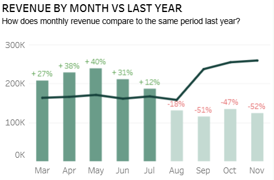

#### Profitability & Efficiency
- The campaigns delivered **£1.43M profit**, with a **ROAS of 9.7** and **£0.93 CPC**, highlighting strong cost control and margin efficiency.
- Profit margins remained consistently high (~91%), suggesting that cost structure and targeting strategy were well optimized throughout the year.
  
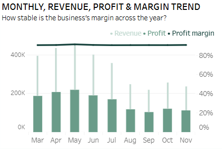

#### Channel Contribution and Seasonality
- **Instagram** was the largest revenue contributor **(£628K, ~40% share)**, acting as the primary growth driver.
- **Pinterest** delivered the strongest efficiency, achieving consistently higher ROAS **(~14–24)** with lower CPC, outperforming both Instagram and Facebook.
- **Facebook** contributed the lowest revenue share and ROAS, indicating diminishing returns compared to other platforms.
- **Fall** generated the highest revenue **(£611K)**, outperforming Summer **(£541K)** and Spring **(£422K)**.
- This suggests that customer purchase intent and campaign effectiveness are strongest in Fall, making it a key period for budget prioritization and scale

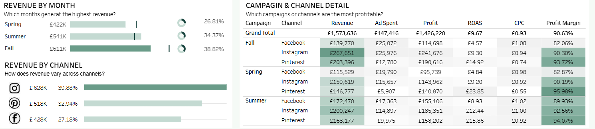

---

### Ads & Engagement Performance Deep Dive

#### Funnel Performance
Impressions totaled **2.95M**, generating **159K clicks (≈5% CTR)** and **36K conversions**, indicating that the primary drop-off occurs between impressions and clicks rather than after the click.
Once users clicked, conversion efficiency remained strong **(22% conversion rate)**, suggesting that landing pages and post-click experience were not the main constraint.

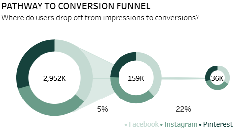

#### Channel Mix & Reach
Facebook generated the largest share of impressions **(36%)**, acting as the main reach driver, followed by Instagram **(34.5%)** and Pinterest **(29.4%)**.
While Facebook led in volume, Instagram and Pinterest contributed a more balanced share of clicks and conversions, pointing to higher engagement quality.

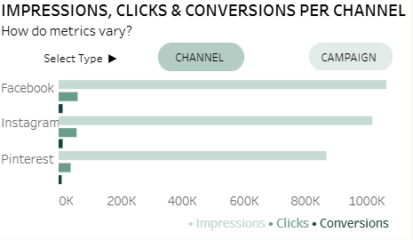

#### Engagement Trends Over Time
Impressions peaked in mid-year at over **400K** per month, then declined sharply from August onward, with clicks and conversions following the same downward pattern.
This indicates that engagement trends were largely driven by traffic volume rather than changes in user behavior or efficiency.

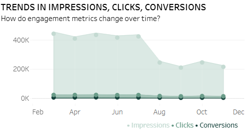

#### Timing & Activity Patterns
Higher impression activity clustered in Spring and early Summer, with performance concentrated on weekdays, particularly mid-week.
This highlights clear windows where ad delivery and budget allocation are more effective

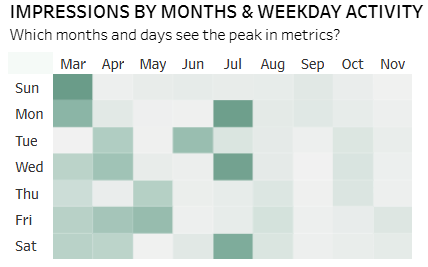

## Recommendations

### Allocate Budget to High-Return Channels
- **Action:** Move incremental budget from Facebook to Pinterest and Instagram.
- **Rationale:** Pinterest delivers the highest ROAS (~14–24) with lower CPC.

### Prioritize Fall and Early Summer Campaigns
- **Action:** Front-load budget into Spring–early Summer and scale heavily in Fall.
- **Rationale:** Fall delivers the strongest revenue performance.

### Unblock the Top-of-Funnel Bottleneck
- **Action:** Test new creatives, messaging, and targeting to increase CTR.
- **Rationale:** Drop-off occurs primarily between impressions and clicks.

### Focus Budget on Successful Time Slots
- **Action:** Increase spend mid-week and reduce low-activity days.
- **Rationale:** Engagement is consistently higher on weekdays.

### Enforce Efficiency Guardrails
- **Action:** Maintain CPC ≈ £1 and ROAS ≥ 9.
- **Rationale:** Profitability is driven by efficiency discipline.

### Diversify Channel Allocation
- **Action:** Rebalance spend monthly across channels.
- **Rationale:** Reduces volatility and preserves ROI.
